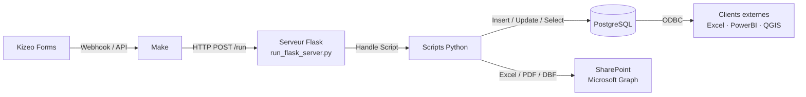
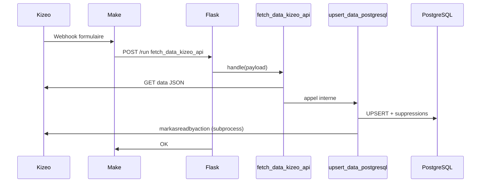
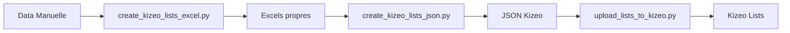
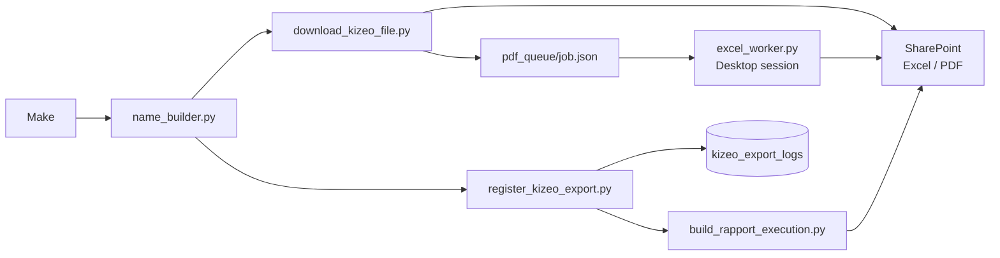
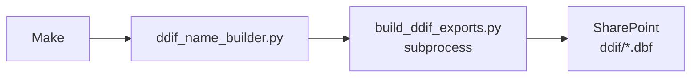
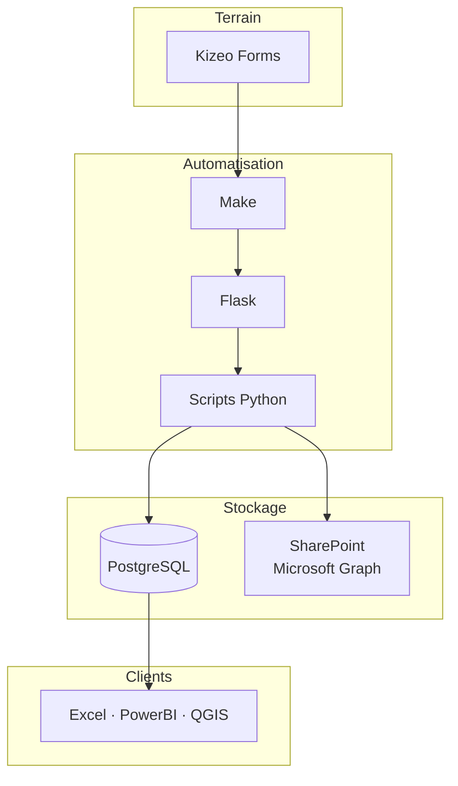

# Architecture complète du pipeline FQCF
*Kizeo → Make → Flask → Scripts Python → PostgreSQL → SharePoint → Clients ODBC*

Ce document décrit l’architecture logique et technique du système, ainsi que les flux entre les différents composants.

---

# 1. Vue générale de l’architecture

Le système se compose de six grandes couches :

1. **Source des données : Kizeo Forms**
2. **Orchestration : Make (webhooks & triggers)**
3. **Serveur interne : Flask (dispatcher de scripts)**
4. **Scripts Python spécialisés (dossier `scripts/`)**
5. **Base de données PostgreSQL + stockage SharePoint (Microsoft Graph)**
6. **Clients finaux : Excel, Power BI, ODBC, etc.**



---

# 2. Description des composants

## 2.1. Kizeo Forms

Kizeo est la source des données opérationnelles terrain.  
Les éléments clés fournis :

- Formulaires (structure)
- Enregistrements (`data_id`)
- Utilisateurs
- Exports prédéfinis (Excel & PDF)
- Listes externes (lookup tables)

Kizeo envoie des **webhooks** vers Make lorsqu’un formulaire est :

- créé,
- modifié,
- supprimé.

Ces webhooks contiennent :
- `form_id`
- `data_id`
- état du formulaire
- informations utilisateur

---

## 2.2. Make (scénarios d'orchestration)

Make sert de couche d'orchestration sécurisée.

Ses rôles :

- **Recevoir les webhooks Kizeo**
- **Lire les données brutes de l’événement**
- **Construire un payload JSON propre**
- **Définir quel script Python doit être exécuté**
- **Appeler l’API Flask interne**

Chaque appel vers Flask inclut :

- Un header `X-Auth-Key` pour authentifier Make
- Un header `X-Script-Name` pour préciser quel script Python doit être exécuté
- Un corps JSON avec toutes les données nécessaires

---

## 2.3. Serveur Flask (`run_flask_server.py`)

Le serveur Flask reçoit les requêtes, valide la sécurité, charge le script demandé et exécute :

```python
def handle(payload, logger) -> dict
```

Il assure également :
- le multithreading,
- les verrous d’exécution,
- les logs centralisés.

---

## 2.4. Scripts Python spécialisés (`scripts/`)

Chaque script :
- gère une responsabilité unique,
- peut être exécuté indépendamment,
- utilise `handle(payload, logger)`.

Exemples :
- Ingestion : `fetch_data_kizeo_api.py`, `upsert_data_postgresql.py`
- Exports : `name_builder.py`, `download_kizeo_file.py`, `build_rapport_execution.py`
- DDIF : `ddif_name_builder.py`, `build_ddif_exports.py`
- Listes : `create_kizeo_lists_excel.py`, `upload_lists_to_kizeo.py`

---

## 2.5. PostgreSQL

Organisation :

- Schémas par `form_id` (ex: schéma `"880205"`, table parent `"880205"`)
- Schéma transversal `app`
- Tables clés : `app.kizeo_export_logs`, `app.kizeo_forms_catalog`, `app.kizeo_form_exports`, `app.coops`, `app.kizeo_users`, etc.
- RLS basée sur `user_ref1` (code coop) et les rôles par coop

---

## 2.6. Stockage SharePoint (Microsoft Graph)

**100% SharePoint via Microsoft Graph.** Aucun fichier n'est écrit sur disque local de façon permanente. Tous les chemins sont relatifs sous `GRAPH_SP_ROOT_DIR` (= `General/`).

Structure principale :

```
General/
 └── <coop_code>/
     └── <year_suffix>/
         └── <form_name>/
             └── [<region>/]
                 └── [<ue>/]
                     ├── fichier_exporté.xlsx / .pdf
                     ├── RE_<UE>.xlsx          (rapport d'exécution)
                     └── ddif/
                         └── <template>.dbf    (exports DDIF)
```

`coop_code` vient de `app.coops.directory`. Voir [sharepoint_structure.md](sharepoint_structure.md) pour la référence complète.

---

## 2.7. Clients finaux (ODBC, Excel, BI)

- Accès direct ODBC
- Compatible Power BI, Excel, QGIS
- RLS = sécurité par coop

---

# 3. Pipelines

## 3.1. Pipeline ingestion

Make appelle un seul script — `fetch_data_kizeo_api` orchestre la suite en interne.



---

# 3.2. Pipeline listes Kizeo



---

## 3.3. Pipeline exports



## 3.4. Pipeline DDIF



---

# 4. Vision complète



---

# 5. Résilience

- Service Windows → redémarrage automatique  
- Logs détaillés  
- Verrous d'exécution  
- Gestion des doublons (data_id + import_pg)  
- Tolérance aux erreurs API Kizeo  

---

# 6. Voir aussi

- [pipeline_kizeo.md](pipeline_kizeo.md) — pipeline ingestion détaillé
- [pipeline_exports.md](pipeline_exports.md) — pipeline exports Excel/PDF détaillé
- [pipeline_data_manuelle.md](pipeline_data_manuelle.md) — import données manuelles et listes Kizeo
- [ddif_architecture.md](ddif_architecture.md) — architecture détaillée du moteur DDIF
- [sharepoint_structure.md](sharepoint_structure.md) — hiérarchie complète des dossiers SharePoint
- [scripts_overview.md](scripts_overview.md) — description de chaque script
- [postgresql_schema.md](postgresql_schema.md) — structure détaillée de la base
