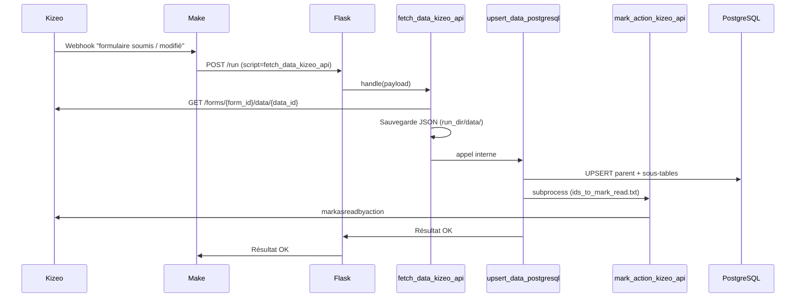
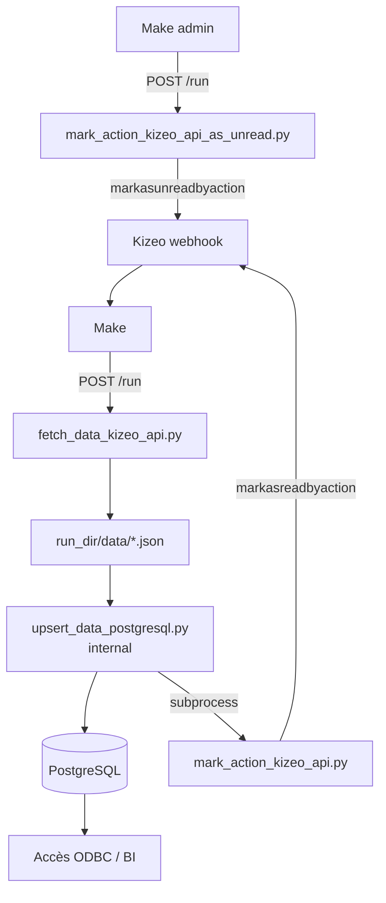

# Pipeline Kizeo → PostgreSQL
*Ingestion automatisée des données de formulaires*

Ce document décrit le pipeline qui permet de récupérer automatiquement les données provenant des formulaires Kizeo, de les transformer et de les stocker dans PostgreSQL.

Ce pipeline est composé de 4 étapes principales :

1. **Prérequis — Synchronisation du catalogue**
2. **Réception du webhook Make**
3. **Téléchargement + upsert (fetch_data_kizeo_api)**
4. **Marquage des enregistrements dans Kizeo (mark action)**

---

# 1. Vue générale du pipeline



---

# 2. Étape 0 — Prérequis : synchronisation du catalogue

Avant la première ingestion d’un formulaire, ses métadonnées doivent être présentes en base. C’est le rôle de `kizeo_schema_builder.py`, appelé **une seule fois par formulaire** lors du setup initial.

`kizeo_schema_builder` appelle automatiquement `sync_kizeo_catalog.py` (mode `single_form`) pour synchroniser dans PostgreSQL :
- `app.kizeo_forms_catalog` — métadonnées du formulaire
- `app.kizeo_form_exports` — exports disponibles
- `app.kizeo_form_fields` — définition des champs (sert à construire le schéma DDL)

Le schéma PostgreSQL cible (ex: `"880205"`) est créé lors de cette étape. Une fois fait, le pipeline d’ingestion peut tourner sans la refaire.

---

# 3. Étape 1 — Webhook Make

Lorsqu’un utilisateur soumet un formulaire dans Kizeo (ou le modifie), Kizeo envoie un webhook à Make.

Make reconstruit un **payload propre** et appelle **un seul script** :

```json
{
  "form_id": "880205",
  "data_id": "177314594",
  "user_id": "562703",
  "bd": "chlorofile2",
  "year_suffix": "2025-2026"
}
```

Make déclenche toujours `fetch_data_kizeo_api.py` — ce script orchestre lui-même la suite (upsert + mark action). Make n’appelle jamais `upsert_data_postgresql` directement, **y compris pour les suppressions**.

Pour une suppression, Make passe `deleted=true` dans la payload :

```json
{
  "form_id": "880205",
  "data_id": "177314594",
  "bd": "chlorofile2",
  "deleted": true
}
```

---

# 4. Étape 2 — Téléchargement + upsert : `fetch_data_kizeo_api.py`

Ce script gère trois modes selon la payload reçue :

### Mode normal (create / update)

Contacte l’API Kizeo v3 :

```text
GET https://www.kizeoforms.com/rest/v3/forms/{form_id}/data/{data_id}
```

Produit un dossier local temporaire :

```text
run_<form_id>_<timestamp>/
 ├── data/
 │    └── <data_id>.json
 └── summary.json
```

### Mode delete (`deleted=true`)

**Skip l’appel API** — le record n’existe plus dans Kizeo. À la place :

```text
run_<form_id>_<timestamp>/
 ├── deleted_ids.txt     ← contient le data_id à supprimer
 └── summary.json        ← "deleted": true, "deleted_ids": [...]
```

`upsert_data_postgresql` lit le `summary.json`, détecte `deleted=true` et traite le tombstone (suppression PostgreSQL).

### Mode batch (sans `data_id`)

Récupère tous les enregistrements non-lus depuis Kizeo et les traite en lot.

---

Dans tous les cas, `fetch_data_kizeo_api` appelle `upsert_data_postgresql` **en interne** avec le `run_dir` généré.

Structure minimale d’un JSON téléchargé :

```json
{
  "_id": 177314594,
  "form_id": 880205,
  "user": { "id": 562703 },
  "fields": {},
  "subforms": {
    "NomSousForm": [
        { "_id": 1, "fields": {} },
        { "_id": 2, "fields": {} }
    ]
  }
}
```

---

# 5. Étape 3 — Insérer / mettre à jour : `upsert_data_postgresql.py`

Ce script est le **cœur du pipeline**.

Il effectue plusieurs actions majeures :

1. Chargement des fichiers JSON dans un run-dir  
2. Aplatissement des données parent + sous-formulaires  
3. Création automatique des tables si nécessaires  
4. UPSERT (insert or update)  
5. Gestion des suppressions (tombstones)  
6. Génération de logs

### 4.1. Aplatissement des données

Table parent (exemple) :

| Colonne     | Description                        |
|------------|------------------------------------|
| `_id`      | identifiant Kizeo                  |
| `_user_id` | id utilisateur Kizeo               |
| `user_ref1`| coop (servant aux règles RLS)      |
| `champ1`   | champ métier                       |
| …          | autres champs du formulaire parent |

Tables enfants (exemple `form_id_sousform`) :

- `_parent_id` (référence vers `_id` du parent)  
- `_id` (id du sous-enregistrement)  
- champs du sous-formulaire

### 4.2. UPSERT

Les opérations principales ressemblent à :

```sql
INSERT INTO schema.form_id (col1, col2, ...)
VALUES (...)
ON CONFLICT (_id) DO UPDATE
SET col1 = EXCLUDED.col1,
    col2 = EXCLUDED.col2;
```

Cette logique est appliquée aux tables parent et enfants.

### 4.3. Suppressions (tombstones)

Si un enregistrement est marqué supprimé côté Kizeo :

- il est supprimé de la table parent,  
- les enregistrements liés dans les sous-formulaires sont supprimés,  
- son identifiant peut être enregistré dans `app.kizeo_tombstones`.

---

# 6. Étape 4 — Marquage dans Kizeo

Deux scripts distincts selon la direction :

### Marquer comme lu après import : `mark_action_kizeo_api.py`

Appelé automatiquement **en subprocess** par `upsert_data_postgresql` après un upsert réussi. Make n’intervient pas.

`upsert_data_postgresql` écrit un fichier `ids_to_mark_read.txt` puis appelle :

```
mark_action_kizeo_api.py --form_id <id> --ids_file ids_to_mark_read.txt --bd <bd> --action import_pg
```

Ce script envoie à Kizeo la liste des `_id` traités via :

```
POST /rest/v3/forms/{form_id}/data/markasreadbyaction
```

Kizeo ne renverra plus ces enregistrements dans les prochains appels “non-lus”.

### Remettre en non-lu : `mark_action_kizeo_api_as_unread.py`

Ce script **a un `handle()`** — Make peut l’appeler directement via le dispatcher Flask. Utilisé pour forcer un re-import (corriger une erreur, rejouer une ingestion).

Il récupère tous les `_id` de la table `<form_id>.<form_id>` et les remet en UNREAD côté Kizeo, par lots de 100.

| Champ payload | Description |
|---|---|
| `bd` | R — base PostgreSQL |
| `form_id` | R — formulaire cible |
| `action` | O — action Kizeo (défaut: `import_pg`) |
| `limit` | O — limiter le nombre d’IDs (test) |
| `dry_run` | O — si true, aucun appel API Kizeo |

---

# 7. Résilience du pipeline

- **Idempotent** : relancer un import ne crée pas de doublons (UPSERT).  
- **Tolérant aux erreurs** : gestion des codes HTTP Kizeo, logs détaillés.  
- **Sécurisé** : API Kizeo via token, Flask protégé par `X-Auth-Key`, PostgreSQL avec RLS.  
- **Traçable** : chaque `data_id` peut être suivi de Kizeo jusqu’à PostgreSQL.

---

# 8. Résumé du pipeline



---

# 9. Voir aussi

- [architecture.md](architecture.md) — vue globale du système
- [pipeline_exports.md](pipeline_exports.md) — pipeline des exports Excel/PDF
- [pipeline_data_manuelle.md](pipeline_data_manuelle.md) — import données manuelles et listes Kizeo
- [scripts_overview.md](scripts_overview.md) — documentation complète par script
- [postgresql_schema.md](postgresql_schema.md) — structure détaillée de la base
- [payloads_by_script.md](payloads_by_script.md) — référence des champs de payload
